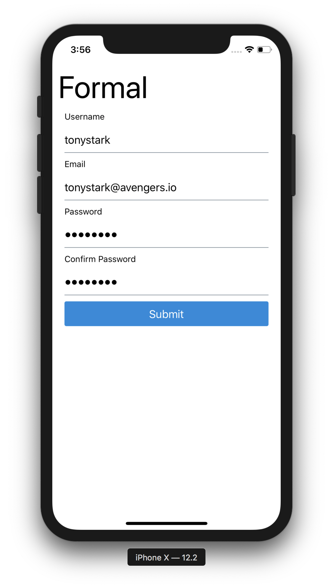

# expo-formal

> Using Expo with Formal to make the world's simplest forms in React Native



# Clone the repo

```bash
$ git clone git@github.com:deadcoder0904/expo-formal.git
```

# Install the dependencies

```bash
$ yarn
```

# Run the app

```bash
$ yarn start
```

# License

MIT © [Akshay Kadam](https://twitter.com/deadcoder0904)
